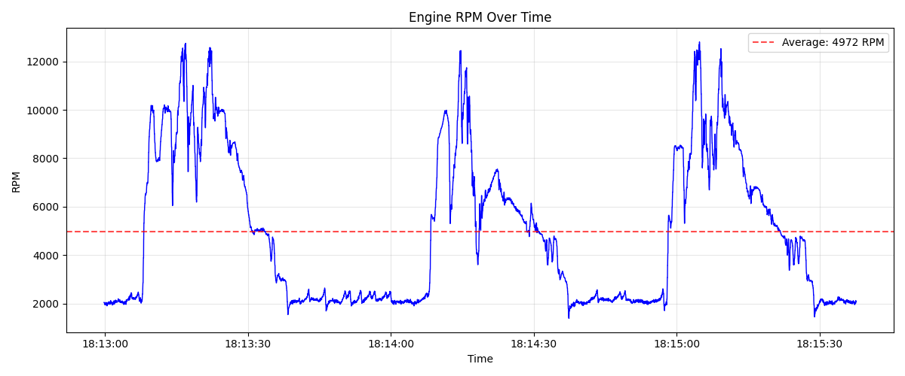
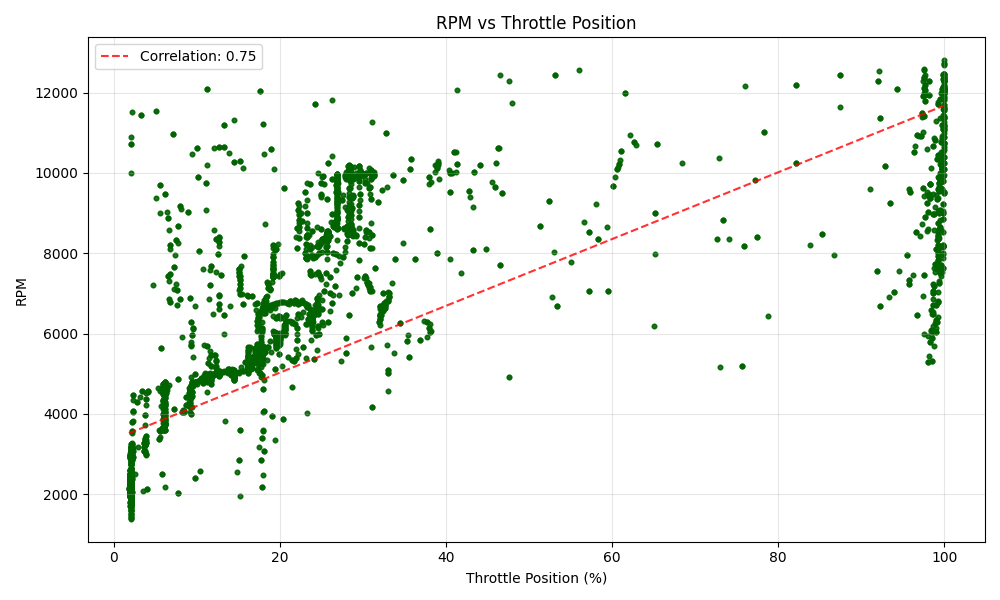
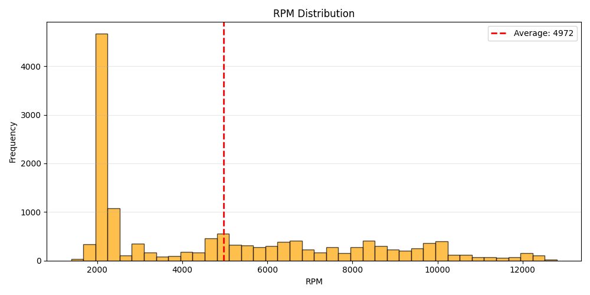

# **Data Analysis**

This project analyzes CAN bus data and focuses on engine RPM and throttle position.

## **Data Cleaning**

- Converted timestamp to readable datetime format

- Removed completely empty columns

- Dropped rows without RPM data

- Filtered out invalid TPS values (0-100% range)

- Cleaned column names by removing special characters

## **RPM Distribution**

- **Low RPM (<2000):** 769 readings (5.4%)

- **Medium RPM (2000-4000):** 6211 readings (43.2%)

- **High RPM (>4000):** 7388 readings (51.4%)

## **Visualizations**

#### **1. Engine RPM Over Time**

*This line chart shows how engine RPM changes throughout the recording session.*

#### **2. RPM vs Throttle Position**

*This scatter plot shows the relationship between throttle position and engine RPM.*

#### **3. RPM Distribution**

*This histogram shows how frequently different RPM values occur.*

## Key Insights

1. The engine typically operates between 4972 RPM

2. There's a positive correlation between throttle position and RPM (0.75)

3. The engine reaches maximum RPM of 12805